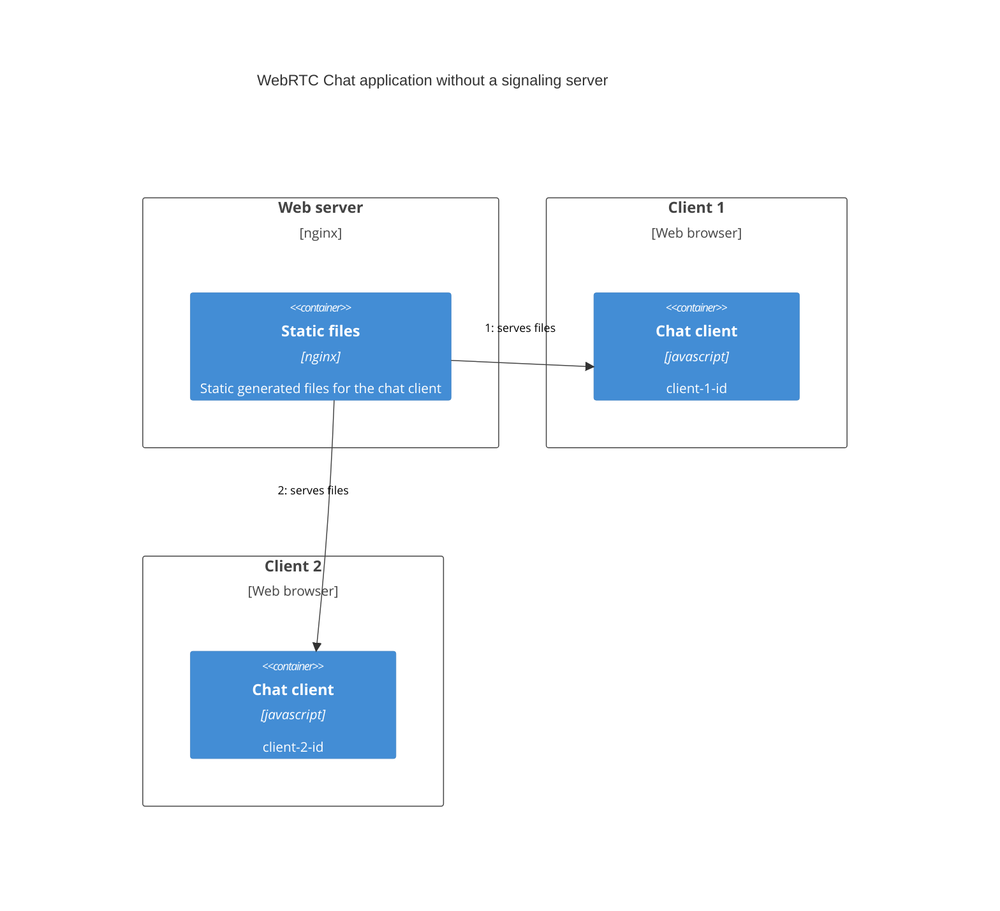

This is a [Next.js](https://nextjs.org/) project bootstrapped
with [`create-next-app`](https://github.com/vercel/next.js/tree/canary/packages/create-next-app).

# chat

This project is a playground for WebRTC. For using WebRTC the [peer](https://github.com/peers/peerjs-server) package is
used in the [signalingserver](signalingserver) project and the [peerjs](https://peerjs.com/) package is used in
the [client](client) project. The chat client is also runnable without the [signalingserver](signalingserver) project.
You can configure the usage of the [signalingserver](signalingserver) by setting environment variables for building the
client.

## Getting Started

First, install packages:

```bash
npm install
```

### Signaling Server

Then, run the signaling server:

```bash
npm -w signalingserver run dev
```

### Next.js client

Finally, run the Next.js client:

```bash
npm -w client run dev
```

Open [http://localhost:3000](http://localhost:3000) with your browser to see the chat client
and [http://localhost:9000](http://localhost:9000) to see the signalingserver.

## client

The client is a [Next.js](https://nextjs.org/) application which generates static HTML. The environment variables
can be set in the [client/.env](client/.env) file.



## signalingserver

The signalingserver is a [Node.js express](https://expressjs.com/) application which is used
for [signaling](https://developer.mozilla.org/en-US/docs/Web/API/WebRTC_API/Signaling_and_video_calling#the_signaling_server)
between the clients.


## Docker

### Client

A [Dockerfile](client/Dockerfile) is available to run the client inside a container. Since a build stage is used inside
the Dockerfile to generate the static HTML, and environment variables cannot be accessed during a build stage, build
arguments have to be passed to the ``docker build`` to configure the client. The following build arguments can be used

- ``SIGNALING_SERVER_ENABLED=true``
- ``SIGNALING_SERVER_HOSTNAME=localhost``
- ``SIGNALING_SERVER_PORT=9000``
- ``SIGNALING_SERVER_ENDPOINT=/chat``
- ``CHAT_CLIENT_PORT=3000``

To build the image of the client run the following command:

```bash
docker build --build-arg SIGNALING_SERVER_ENABLED=true --build-arg SIGNALING_SERVER_HOSTNAME=localhost --build-arg SIGNALING_SERVER_PORT=9000 --build-arg SIGNALING_SERVER_ENDPOINT=/chat --build-arg CHAT_CLIENT_PORT=3000 -t chat-client ./client/.
```

Afterwards the container can be started with the following command. The ``PORT`` env variable has to be set, since the
[nginx.conf.template](client/nginx.conf.template) uses it to configure the port for the client. Environment variables
used in the conf.template file will be automatically replaced ([see section _Using environment variables in nginx
configuration_](https://hub.docker.com/_/nginx)).

```bash
docker run -p 3000:3000 chat-client
```

### Signaling Server

A [Dockerfile](signalingserver/Dockerfile) is available to run the signaling server inside a container.

To build the image of the signaling server run the following command:

```bash
docker build -t chat-signalingserver ./signalingserver/.
```

Afterwards the container can be started with the following command. The following environment variables can be used for
configuring the signaling server.

- ``PORT=9000``
- ``NODE_ENV=development``
- ``BEHIND_PROXY=false``
- ``SSL_ENABLED=false``
- ``SSL_KEY_PATH=``
- ``SSL_CERT_PATH=``

```bash
docker run -p 9000:9000 -e PORT=9000 -e NODE_ENV=development chat-signalingserver
```

### docker compose

Also, a [docker-compose.yaml](docker-compose.yaml) file is available to run the client and/or the server.

To build the image of the client use the following command:

```bash
docker compose build chat-client
```

For running the client use the following command:

```bash
docker compose up chat-client
```

To build the image of the signaling server use the following command:

```bash
docker compose build chat-signalingserver
```

For running the signaling server use the following command:

```bash
docker compose up chat-signalingserver
```

For running both, the client and the server use

```bash
docker-compose up
```

## favicon.ico

The emoji graphics ([favicon.ico](client/public/favicon.ico)) are from the open source
project [Twemoji](https://twemoji.twitter.com/).

## Useful links

- https://www.stackfive.io/work/webrtc/peer-to-peer-video-call-with-next-js-socket-io-and-native-webrtc-apis
- https://www.wowza.com/blog/webrtc-signaling-servers
- https://expressjs.com/en/resources/middleware/cors.html
- https://developer.mozilla.org/en-US/docs/Web/API/WebRTC_API/Build_a_phone_with_peerjs/Build_the_server
- https://github.com/montali/quaranChat/blob/master/src/components/MainView.js
- https://developer.mozilla.org/en-US/docs/Web/CSS/CSS_Flexible_Box_Layout/Aligning_Items_in_a_Flex_Container
- https://medium.com/@captivechains/how-i-built-a-p2p-chat-app-in-node-js-dbd54f55f569
- https://stackoverflow.com/questions/29032884/why-is-a-signaling-server-needed-for-webrtc
- https://medium.com/@leontosy/building-a-p2p-web-app-with-react-and-liowebrtc-6a7e8c621085
- https://github.com/d4l3k/webrtc-lobby
- https://github.com/vardius/react-webrtc-chat
- https://stackoverflow.com/questions/20068944/how-to-self-host-to-not-rely-on-webrtc-stun-server-stun-l-google-com19302/20134888#20134888
- https://github.com/Codaisseur/react-p2p-chat/blob/master/src/index.js
- https://github.com/feross/simple-peer#install
- https://www.stackfive.io/work/webrtc/peer-to-peer-video-call-with-next-js-socket-io-and-native-webrtc-apis
- https://dev.to/rallipi/build-a-mobile-chat-layout-with-tailwindcss-4dk
- https://www.w3.org/TR/webrtc/#rtcdatachannelevent
- https://reactjs.org/docs/hooks-custom.html
- https://developer.mozilla.org/en-US/docs/Web/API/RTCPeerConnection/iceconnectionstatechange_event
- https://developer.mozilla.org/en-US/docs/Web/API/WebRTC_API/Simple_RTCDataChannel_sample
- https://webrtc.org/getting-started/overview
- https://www.liveswitch.io/blog/webrtc-e2ee-encryption
- https://www.preveil.com/blog/end-to-end-encryption/
- https://developer.mozilla.org/en-US/docs/Glossary/Symmetric-key_cryptography
- https://en.wikipedia.org/wiki/Authenticated_encryption
- https://blog.excalidraw.com/end-to-end-encryption/
- https://braydoncoyer.dev/blog/tailwind-gradients-how-to-make-a-glowing-gradient-background
- https://github.com/vercel/next.js/blob/canary/examples/progressive-web-app/package.json
- https://www.npmjs.com/package/next-pwa